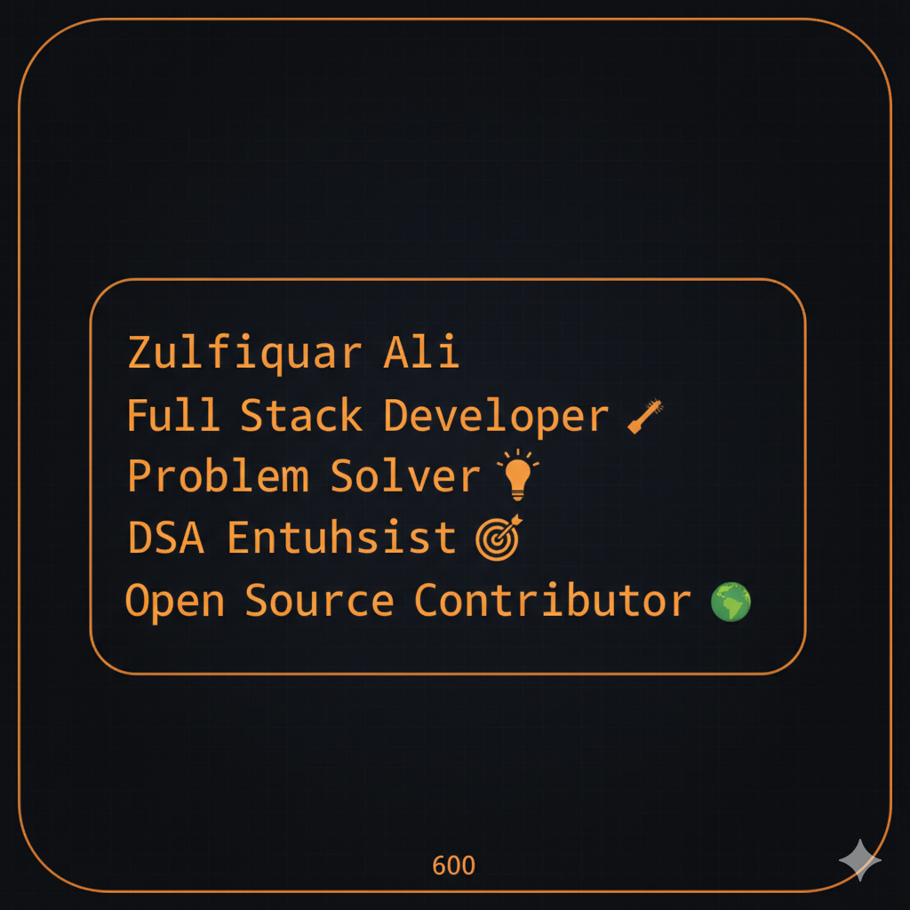

# 👋 Hey there, I'm Zulfiquar Ali!

<div align="center">
  
</div>

<div align="center">
  
</div>

<div align="center">
  
[](https://github.com/zulfie1003)
[](https://github.com/zulfie1003?tab=repositories)
[](https://github.com/zulfie1003)

</div>

---

##  About Me

```javascript
const zulfiquar = {
  pronouns: "He/Him",
  location: "India 🇮🇳",
  currentFocus: "Full Stack Development ,DSA & System Design",
  funFact: "I debug with console.log() and I'm not ashamed! 😄",
  askMeAbout: ["JavaScript", "React", "Next.js","Node.js", "DSA", "Linux"],
  technologies: {
    frontEnd: ["React", "Next.js", "TypeScript", "Tailwind CSS"],
    backEnd: ["Node.js", "Express.js", "MongoDB", "RESTful APIs"],
    languages: ["JavaScript", "TypeScript", "C++", "C"],
    tools: ["Git", "Docker", "Linux", "VS Code", "Postman"],
    databases: ["MongoDB", "PostgreSQL", "Redis"]
  },
  currentlyLearning: ["System Design", "DevOps", "Microservices"]
};
```

---

## 🌐 Connect With Me

<div align="center">
  
  [](https://www.linkedin.com/in/zulfiquar-ali-931774281/)
  [](https://x.com/zulfie1900)
  [](https://leetcode.com/u/Zulfie2003/)
  [](https://github.com/zulfie1003)
  [](https://zulfie1003.github.io/portfolio/)
</div>

---

##  Tech Stack & Tools

### Languages & Frameworks
<div align="center">
  
  
  
  
  
  
  
  
  
  
</div>

### Database & Cloud
<div align="center">
  
  
  
  
  
</div>

### Tools & Platforms
<div align="center">
  
  
  
  
  
  
  
  
</div>

---

##  Featured Projects

<div align="center">
  
  | Project | Description | Tech Stack | Links |
  |---------|-------------|------------|-------|
  | 🔬 **Vetcare** | Veterinary Telimedicine Plateform | React, Node.js, MongoDB, Socket.io, Razorpay, Agora.io | [Live](https://vet-care-plateform-crm.vercel.app/) |
  | 🧠 **Second Brain** | Smart Notes & Knowledge Manager | React, Node.js, MongoDB | [Live](https://second-brain-project.vercel.app/) |
  | 📝 **Study-Helper AI** | AI Study Assistant | React, TypeScript, Node.js, OpenAI, Gemini API | [Live](https://study-helper-six.vercel.app/) |
  |  **DSA Mastery** | A visual mindmap view  | MERN Stack | [Live](https://dsa-mastery-project.vercel.app/) |
</div>


---

## 📊 GitHub Analytics

<div align="center">
  
 


</div>

<div align="center">
  
  
  
</div>

<div align="center">
 


  
  
</div>

---

##  Current Focus

```yaml
Learning:
  - System Design Basics
  - DevOps basic & CI/CD Pipelines
  - Advanced DSA & Competitive Programming
  - Microservices Architecture
  - Cloud Computing (AWS/GCP)

Goals_2025:
  - Build scalable applications
  - Master System Design
  - Improve problem-solving skills
```

---

## 🏆 GitHub Trophies

<div align="center">
  
  
  
</div>


---

## 💭 Random Dev Quote

<div align="center">
  
  
  
</div>

---

## 🤝 Let's Collaborate!

I'm always open to interesting conversations and collaboration opportunities. Whether you want to:

- 🚀 Work on exciting projects together
- 💡 Share knowledge and learn from each other
- 🌟 Contribute to open source
- 🎯 Solve challenging problems

**Feel free to reach out!** I'm just a message away on [LinkedIn](https://www.linkedin.com/in/zulfiquar-ali-931774281/) or [Twitter](https://x.com/zulfie1900).

---

<div align="center">
  
  **Thanks for visiting my profile! Have a great day! 🌟**
  
  
  
</div>

---

<div align="center">
  
  ⭐️ From [Zulfiquar Ali](https://github.com/zulfie1003)
  
</div>
